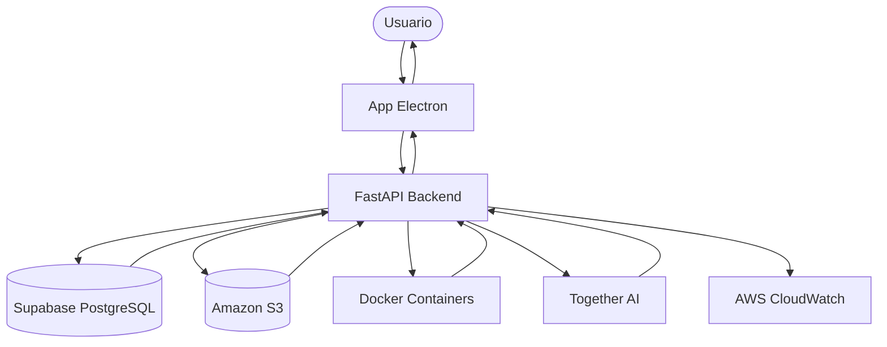

# WISPR — Infraestructura

```mermaid
flowchart TD
    A([Usuario]) --> B[App Electron]
    B --> C[FastAPI Backend]
    C --> D[(Supabase PostgreSQL)]
    C --> E[(Amazon S3)]
    C --> F[Docker Containers]
    C --> G[Together AI]
    C --> H[AWS CloudWatch]
    D & E & F & G --> C
    C --> B
    B --> A
```
